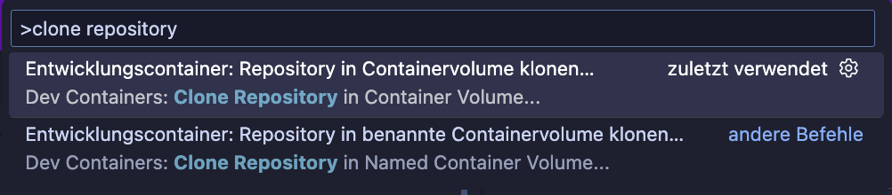

# Development

Install the [Dev Containers](ms-vscode-remote.remote-containers) extension in VSCode. Then press `Ctrl+Shift+P` / `Cmd+Shift+P` and select `Dev Containers: Clone Repository in Container Volume...`. In the following selection menu choose `Github` and then the `actcoding/intranet` repository.

